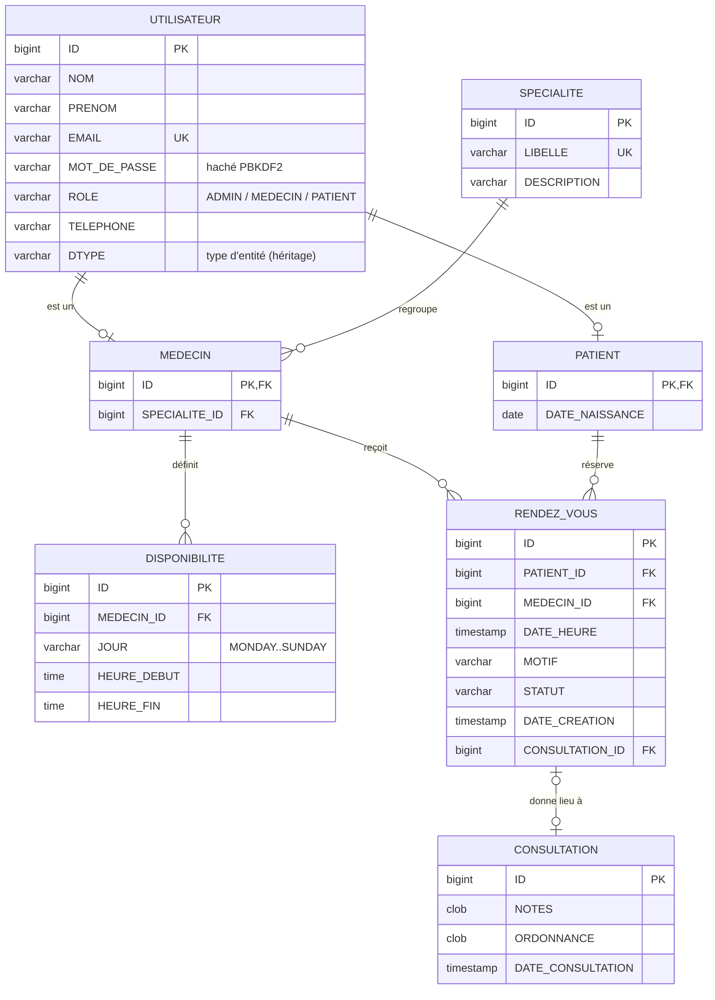
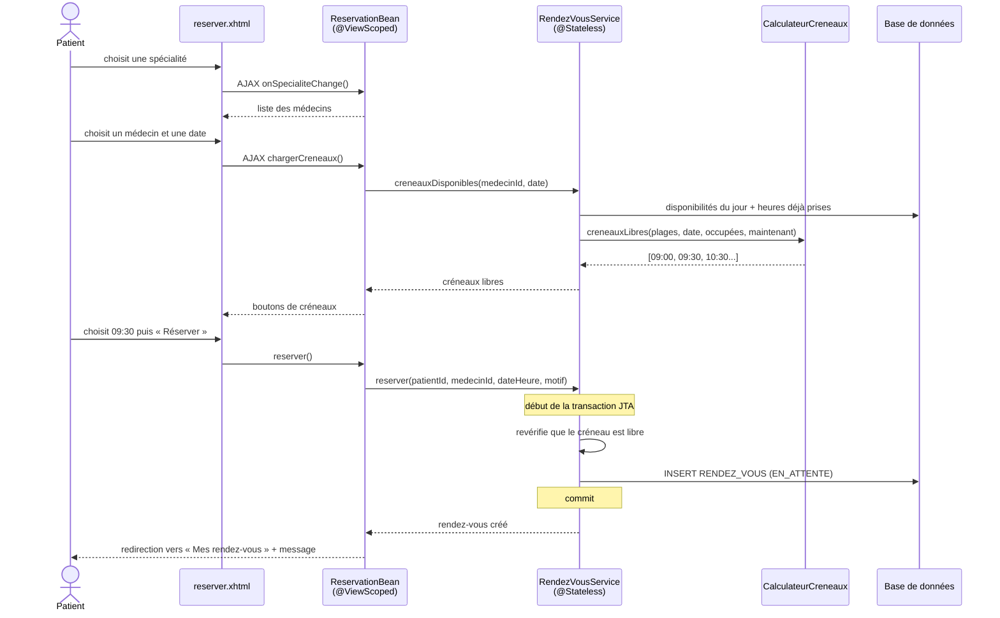
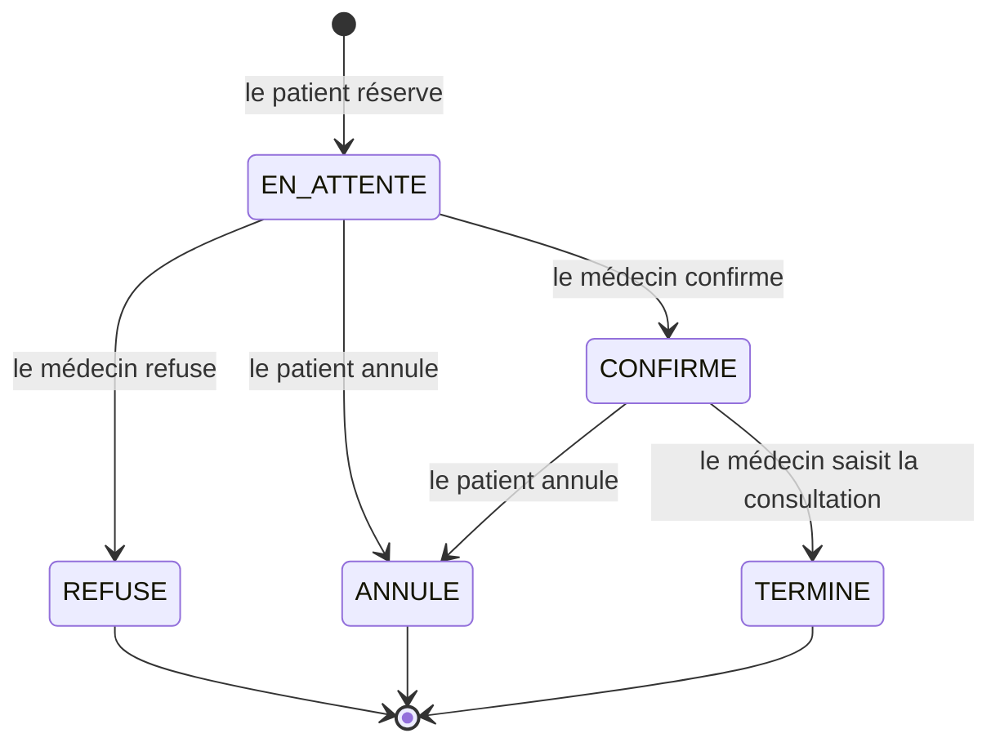

# Architecture de MediBook

Ce document explique comment l'application est organisée, et pourquoi.

## 1. Architecture en couches

MediBook suit une architecture en couches classique. Chaque couche ne parle qu'à la couche juste en dessous.

```mermaid
flowchart TB
    subgraph Client
        NAV[Navigateur]
        APP[Client REST<br/>curl, Postman, app mobile]
    end

    subgraph Presentation["Présentation (package web / rest)"]
        XHTML[Pages XHTML<br/>JSF + PrimeFaces]
        BEANS[Beans JSF<br/>@Named @ViewScoped]
        REST[Ressources JAX-RS<br/>@Path]
    end

    subgraph Securite["Sécurité (package securite)"]
        FILTRE[FiltreSecurite<br/>@WebFilter]
        SESSION[SessionUtilisateur<br/>@SessionScoped]
    end

    subgraph Metier["Métier (packages service / metier)"]
        EJB[Services EJB<br/>@Stateless, transactions]
        CALC[CalculateurCreneaux<br/>logique pure]
    end

    subgraph Persistance["Persistance (package model)"]
        ENT[Entités JPA<br/>@Entity]
        EM[EntityManager]
    end

    DB[(Base de données<br/>H2 / MySQL)]

    NAV --> FILTRE --> XHTML --> BEANS
    APP --> REST
    BEANS --> SESSION
    BEANS --> EJB
    REST --> EJB
    EJB --> CALC
    EJB --> EM --> ENT --> DB
```

| Couche | Rôle | Technologies |
|---|---|---|
| Présentation | Afficher les données et recevoir les actions de l'utilisateur | JSF, PrimeFaces, JAX-RS |
| Sécurité | Vérifier qui est connecté et ce qu'il a le droit de voir | Filtre Servlet, CDI `@SessionScoped` |
| Métier | Appliquer les règles (créneau libre, statuts...) dans une transaction | EJB `@Stateless`, classes Java pures |
| Persistance | Faire correspondre les objets Java aux tables | JPA / EclipseLink |

**Pourquoi séparer ?**

- Les règles métier sont écrites **une seule fois** dans les services, puis réutilisées par les pages JSF **et** par l'API REST.
- La logique pure (`CalculateurCreneaux`) se teste sans serveur.
- On peut changer l'interface (passer à React, par exemple) sans toucher au métier.

## 2. Rôle de chaque package

| Package | Contenu | Exemples |
|---|---|---|
| `model` | Entités JPA et énumérations | `Utilisateur`, `Patient`, `Medecin`, `RendezVous`, `StatutRendezVous` |
| `metier` | Algorithmes indépendants de Jakarta EE | `CalculateurCreneaux`, `PlageHoraire` |
| `service` | EJB transactionnels, un par domaine | `RendezVousService`, `MedecinService`, `MetierException` |
| `securite` | Authentification et autorisation | `MotDePasseUtil`, `SessionUtilisateur`, `FiltreSecurite` |
| `web` | Un bean JSF par page (ou groupe de pages) | `ReservationBean`, `PlanningMedecinBean` |
| `rest` | API REST : ressources, DTO et gestion des erreurs | `MedecinResource`, `MedecinDTO`, `MetierExceptionMapper` |
| `config` | Démarrage de l'application | `DonneesDemo` (`@Singleton @Startup`) |

## 3. Modèle de données



### Points JPA à retenir

| Notion | Où ? | Explication |
|---|---|---|
| Héritage `JOINED` | `Utilisateur` → `Patient`, `Medecin` | Une table par classe, reliées par la clé primaire. Les champs communs restent dans `UTILISATEUR`. |
| `@ManyToOne` | `Medecin.specialite`, `RendezVous.patient`... | Côté « plusieurs » de la relation, qui porte la clé étrangère. |
| `@OneToOne(cascade = ALL)` | `RendezVous.consultation` | Enregistrer le rendez-vous enregistre aussi la consultation. |
| `@Enumerated(STRING)` | `Role`, `StatutRendezVous`, `DayOfWeek` | On stocke `"CONFIRME"` plutôt que `1`. C'est plus lisible et on peut réordonner l'enum sans casser la base. |
| `@NamedQuery` | Sur chaque entité | Requêtes JPQL vérifiées dès le déploiement. |
| `@PrePersist` | `RendezVous.avantEnregistrement()` | Remplit la date de création automatiquement. |
| Types `java.time` | `LocalDate`, `LocalTime`, `LocalDateTime` | Pris en charge nativement depuis JPA 2.2. |
| Pas de `@OneToMany` | — | Choix volontaire : on passe par des requêtes. Cela évite les pièges du chargement paresseux (`LazyInitializationException`) dans les pages JSF. |

### Génération des identifiants : pourquoi `GenerationType.TABLE` ?

Chaque entité utilise un `@TableGenerator` : les compteurs d'identifiants sont stockés dans une petite table `GENERATEUR_ID`, avec une ligne par entité (`UTILISATEUR`, `SPECIALITE`, `RENDEZ_VOUS`...).

- Cette stratégie **fonctionne avec toutes les bases** : H2, MySQL, PostgreSQL, Oracle...
- L'identifiant est connu **dès le `persist()`**, sans attendre l'écriture en base.
- On n'utilise pas `IDENTITY` (auto-incrément) : EclipseLink 4.0, le fournisseur JPA de Payara 6, génère pour H2 2.x une syntaxe `BIGINT IDENTITY` que cette version de H2 refuse. Le déploiement échouerait.

## 4. Déroulement d'une réservation



Le serveur **revérifie** la disponibilité du créneau au moment de réserver. Entre l'affichage et le clic, un autre patient a pu le prendre. Si c'est le cas, une `MetierException` est levée, la transaction est annulée et l'utilisateur voit le message d'erreur.

> Limite connue : deux réservations envoyées exactement au même instant pourraient passer toutes les deux. En production, on ajouterait une contrainte d'unicité en base ou un verrou pessimiste (`LockModeType.PESSIMISTIC_WRITE`) sur le médecin.

## 5. Cycle de vie d'un rendez-vous



Les transitions autorisées sont codées dans l'énumération `StatutRendezVous` (`peutEtreAnnule()`, `peutEtreConfirmeOuRefuse()`, `peutEtreTermine()`) et testées dans `StatutRendezVousTest`.

## 6. Sécurité

| Mesure | Implémentation |
|---|---|
| Mots de passe jamais stockés en clair | `MotDePasseUtil` : PBKDF2-HMAC-SHA256, 65 536 itérations, sel aléatoire de 16 octets |
| Contrôle d'accès par rôle | `FiltreSecurite` protège `/admin/*`, `/medecin/*` et `/patient/*` |
| Vérification de propriété | Les services vérifient que le rendez-vous appartient bien au patient ou au médecin connecté |
| Fixation de session | `request.changeSessionId()` à la connexion |
| Cookie de session | `http-only` (web.xml), donc illisible en JavaScript |
| Pages privées non mises en cache | En-têtes `Cache-Control: no-store` ajoutés par le filtre |
| Données exposées par l'API | Des DTO, et jamais les entités : ni email ni mot de passe dans le JSON |
| Injection SQL | Impossible avec JPQL paramétré (`setParameter`) |
| XSS | JSF échappe automatiquement les valeurs affichées |
| CSRF | Le `ViewState` de JSF protège les formulaires |

## 7. Portées (scopes) CDI utilisées

| Portée | Durée de vie | Utilisée pour |
|---|---|---|
| `@RequestScoped` | Une requête HTTP | `LoginBean`, `InscriptionBean`, `StatistiqueBean`, ressources REST |
| `@ViewScoped` | Tant qu'on reste sur la même page | Beans des pages avec AJAX (réservation, planning, admin...) |
| `@SessionScoped` | Toute la session de l'utilisateur | `SessionUtilisateur` |
| `@Stateless` (EJB) | Pool géré par le serveur | Services métier |
| `@Singleton` (EJB) | Une instance pour toute l'application | `DonneesDemo` |
